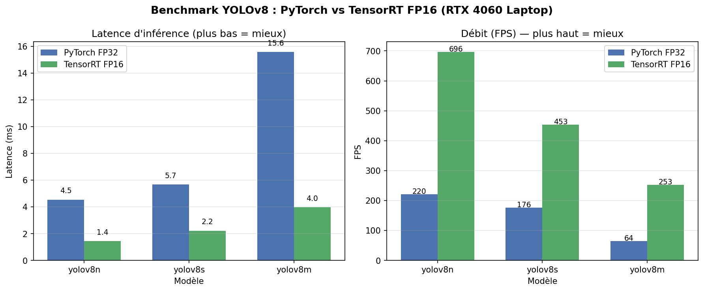

# 🚁 Drone YOLO TensorRT

Optimisation d'un pipeline de détection **YOLOv8 → TensorRT FP16** et
intégration à un drone **PX4 SITL** sous **Gazebo + ROS 2** pour du suivi
autonome de cible.

Projet basé sur [monemati/PX4-ROS2-Gazebo-YOLOv8](https://github.com/monemati/PX4-ROS2-Gazebo-YOLOv8) (simulation Docker),
contribution personnelle : conversion TensorRT, benchmarking, et nœud de
suivi automatique.

## 🎯 Ce que fait le projet

1. Convertit YOLOv8 (n / s / m) PyTorch en moteurs **TensorRT FP16**
2. Compare la latence et le FPS des deux formats sur RTX 4060
3. Fait suivre une voiture par un drone en autonomie

## ⚙️ Environnement

Ubuntu 22.04 · RTX 4060 Laptop · CUDA 13 · PyTorch 2.14 · TensorRT 11.3 · ROS 2 Humble

## 🚀 Utilisation

```bash
python3 -m venv venv && source venv/bin/activate
pip install -r requirements.txt

# Convertir YOLOv8 en TensorRT FP16
cd tensorrt-benchmark
python3 convert_to_tensorrt.py
```

## 📊 Résultats — Benchmark PyTorch vs TensorRT

Mesures sur **RTX 4060 Laptop** (CUDA 13, PyTorch 2.14, TensorRT 11.3),
100 inférences avec warmup GPU de 10 runs, résolution 640×640.

| Modèle    | PyTorch FP32 | TensorRT FP16 | Speedup   | FPS (TRT) |
|-----------|-------------:|--------------:|----------:|----------:|
| YOLOv8n   |      4.54 ms |    **1.44 ms**|  **3.16×**|   **696** |
| YOLOv8s   |      5.67 ms |    **2.21 ms**|  **2.57×**|   **453** |
| YOLOv8m   |     15.57 ms |    **3.96 ms**|  **3.94×**|   **253** |

**Écart-type TensorRT** ≤ 0.18 ms (vs jusqu'à 0.88 ms côté PyTorch), soit
une latence non seulement plus faible mais aussi **plus prédictible** —
critère clé pour du contrôle temps réel embarqué.



Données brutes : `results/benchmark.csv`.

## 👤 Auteur

**Hoang Long DUONG** 
